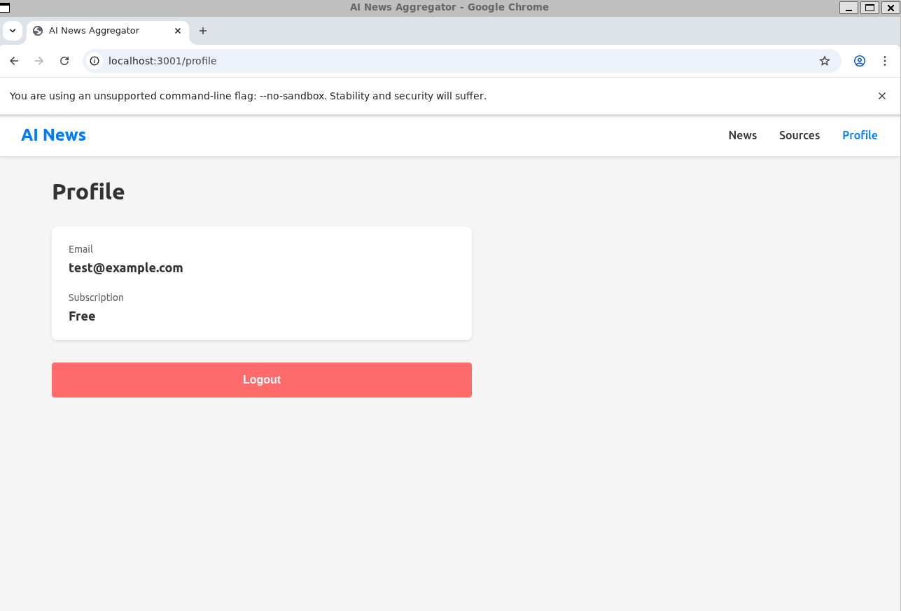
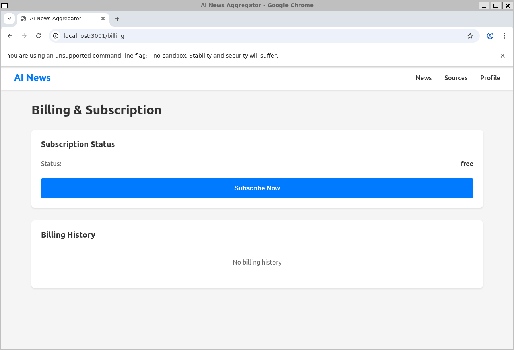
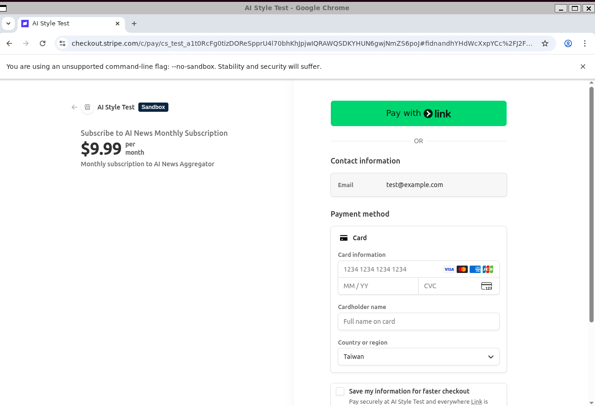
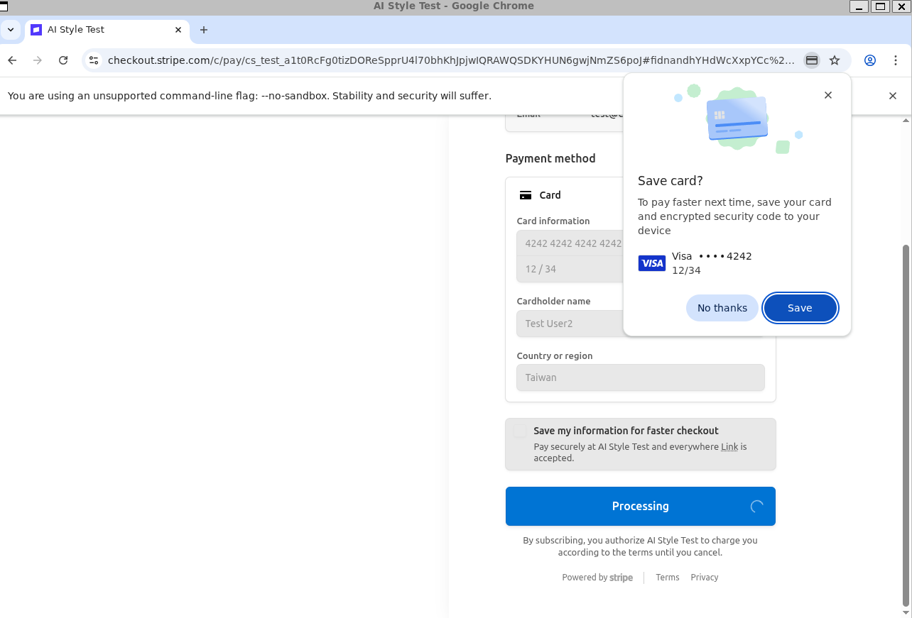
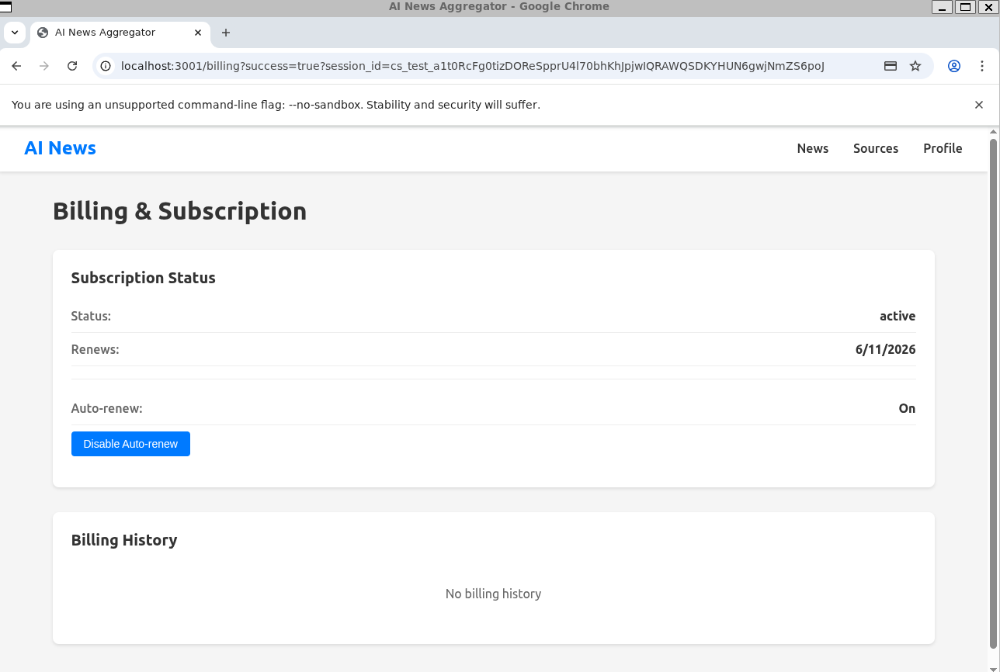
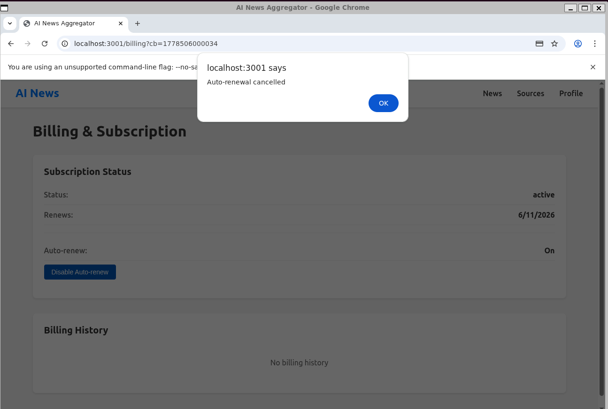

# NewsLens — AI-Powered News, Filtered Sharply


NewsLens is a news aggregation app that tracks news from multiple sources based on per-user keywords, then scores every article for fake-news / clickbait / phishing signals. iOS + Web clients backed by a Node/Postgres API with Stripe-powered monthly subscriptions.

## Features

### Core
- **Multi-source aggregation** — bring your own news sources (Google News, UDN, Yahoo, etc.) with per-source keyword filters.
- **AI scoring** — each article is tagged with three signals:
  - Fake-news rate
  - Clickbait rate
  - Phishing rate
- **Latest-first feed** — sorted by publication date with source/keyword facets.

### Subscription tiers
- **Free** — 3 sources, 3 keywords per source.
- **Paid (USD $9.99 / month)** — unlimited sources and keywords.

### Billing
- Stripe Checkout for card capture (test mode supports Sandboxes).
- Graceful cancel (`cancel_at_period_end`) — keeps access until period end, UI flips from `Renews on` to `Expires on`.
- Webhook-driven state sync (`checkout.session.completed`, `invoice.payment_succeeded`, `customer.subscription.deleted`).

### Authentication
- JWT-based session with `/api/auth/register`, `/api/auth/login`, `/api/auth/me`.

## Screenshots

| Step | View |
|---|---|
| 1. Auth / Profile |  |
| 2. Billing — free tier |  |
| 3. Stripe-hosted checkout |  |
| 4. Success redirect |  |
| 5. Active — "Renews on" |  |
| 6. Cancelled — "Expires on" |  |

## Tech Stack

### Frontend
- React (Web) + Vite
- React Native + Expo (iOS)
- React Router, TanStack Query
- AsyncStorage on iOS, `localStorage` on Web (JWT)

### Backend
- Node.js 20 + Express
- PostgreSQL (with optional SQLite for dev)
- JWT (`jsonwebtoken`)
- Puppeteer + Cheerio for scraping
- Stripe Node SDK

### Infrastructure
- Stripe Sandboxes for test-mode billing
- Per-user daily / monthly quota enforcement to bound hosting cost
- Multi-push `git origin` (GitLab + GitHub mirror)

## Project Structure

```
newslens/
├── mobile/                 # React Native / Expo
├── web/                    # React + Vite
├── backend/                # Express API
├── docs/                   # Setup guides + screenshots
├── scripts/                # Dev helpers (stripe CLI, slack_notify, test_subscription_flow.sh)
└── .github/, .gitlab-ci.yml, .pre-commit-config.yaml
```

## Getting Started

### Prerequisites
- **Node.js 20** (see [docs/SETUP_NODE.md](./docs/SETUP_NODE.md))
- **PostgreSQL** (`bash backend/scripts/install-postgresql-wsl.sh` for WSL)
- Xcode + EAS CLI (iOS only)

### Installation

```bash
# 1. Clone
git clone git@github.com:osisdie/newslens.git
cd newslens

# 2. Node 20 (if not default)
npm run setup-node
npm run setup-nvm

# 3. Install per workspace (separate due to React version differences)
cd backend  && npm install && cd ..
cd web      && npm install && cd ..
cd mobile   && npm install --legacy-peer-deps && cd ..

# 4. Configure env
cp .env.example .env
# edit .env with your Stripe sandbox keys, JWT secret, etc.

# 5. Initialize DB
cd backend && npm run create-db && cd ..

# 6. Start backend + web (separate terminals)
npm run dev:backend
npm run dev:web

# 7. iOS (separate terminal)
cd mobile && npm run ios
```

### Pre-commit hooks (recommended)

Catches secrets before they leave your machine:

```bash
pip install pre-commit
pre-commit install
# Test it:
pre-commit run --all-files
```

## Environment Variables

All env vars live in **one place**: the root `./.env` (gitignored). Copy from [`.env.example`](./.env.example) and edit.

### Required
- `DATABASE_URL` — Postgres connection string
- `JWT_SECRET` — generate with `openssl rand -base64 32`
- `STRIPE_SECRET_KEY` — from Stripe Dashboard or Sandbox
- `STRIPE_WEBHOOK_SECRET` — from `stripe listen` output (local) or webhook endpoint config (prod)
- `SUBSCRIPTION_PRICE_ID` — Stripe price ID for the monthly plan

### Optional (with defaults)
- `PORT` (3000), `NODE_ENV` (development)
- Quota knobs: `DAILY_API_LIMIT`, `MONTHLY_API_LIMIT`, `DAILY_SCRAPE_LIMIT`, `MONTHLY_SCRAPE_LIMIT`

### Client-side
- `VITE_API_URL` (web, defaults to `/api` via Vite proxy)
- `EXPO_PUBLIC_API_URL` (mobile, defaults to `http://localhost:3000/api`)

For Stripe setup, see [docs/STRIPE_SETUP.md](./docs/STRIPE_SETUP.md).

## Subscription Test Flow

End-to-end script that walks `free → active → cancel-auto-renew → immediate cancel`:

```bash
./scripts/test_subscription_flow.sh
# Follow the printed checkout URL, pay with test card 4242 4242 4242 4242
```

See script for assertions and DB queries you can use during manual debugging.

## iOS App Release

See [docs/IOS_RELEASE_GUIDE.md](./docs/IOS_RELEASE_GUIDE.md) for TestFlight + App Store walkthrough.

```bash
npm install -g eas-cli
cd mobile && eas build:configure
eas build --platform ios --profile production
eas submit --platform ios
```

## CI / Security

- **GitHub Actions** (`.github/workflows/ci.yml`) — gitleaks scan + `npm ci` matrix (backend syntax-check, web `vite build`)
- **GitLab CI** (`.gitlab-ci.yml`) — same jobs for the GitLab mirror
- **Pre-commit** (`.pre-commit-config.yaml`) — gitleaks + hygiene hooks block secret leaks at commit time

## License

MIT — see [LICENSE](./LICENSE).
